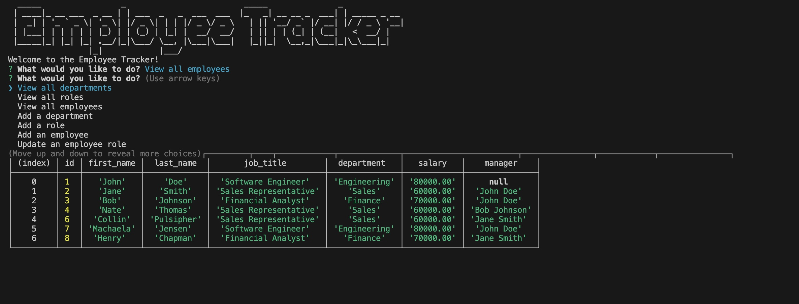

# Employee tracker
    

    
## Description
Welcome to the Employee Tracker! This command-line application helps you manage departments, roles, and employees within your organization.
    
## Table of Contents
- [Installation](#installation)
- [Usage](#usage)
- [License](#license)
- [Contributing](#contributing)
- [Questions](#questions)
    
## Installation
Clone the repository to your local machine and open in a code editor. If you haven't already, install node.js. Open your terminal and run the command npm install to install the dependencies for this project.

Repository Link: https://github.com/cpulsipher24/employee-tracker
    
## Usage
This app should be used to manage and keep track of employees across multiple departments at a company. 

## Walkthrough Video Link
https://watch.screencastify.com/v/0s7vcCksMZBOrh2vDl5Y

## Screenshot

    
## Contributing
This project is open to collaboration. If you want to contribute, fork the repository and feel free to add code and create a pull request for review. 
    
## Questions
For questions or concerns, please contact me through my [GitHub profile](https://github.com/cpulsipher24) or via email at collintpulsipher@gmail.com.
